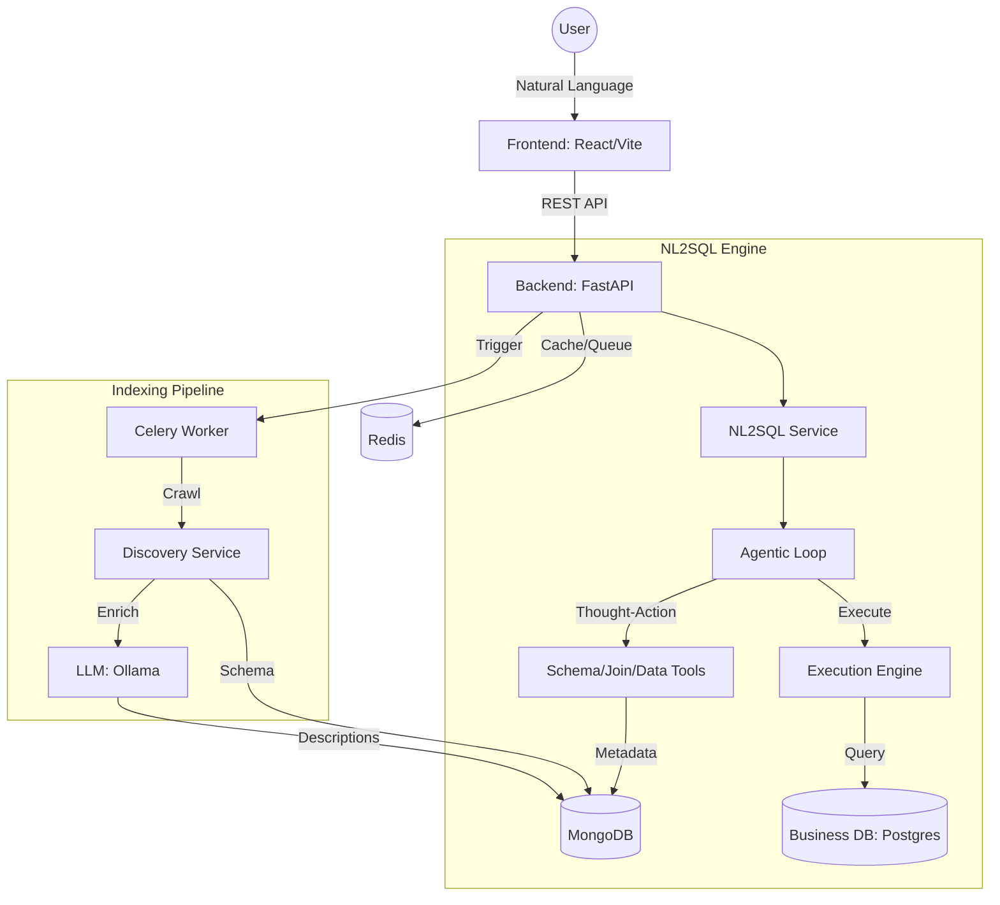

<p align="center">
  
</p>

<h1 align="center">MiraOS</h1>

<p align="center">
  <b>The Agentic Business Operating System</b><br>
  Chat, automate, and query your business data with a single, intelligent platform.
</p>

---

## 🏗 Architecture

MiraOS is built with a decoupled architecture designed for scale and agentic autonomy.



## 🧠 Agentic NL2SQL Engine

Unlike traditional text-to-SQL systems, MiraOS uses a **Thought-Action-Observation** loop:
1.  **Thought**: The agent reasons about the user's question and what schema info it needs.
2.  **Action**: It uses tools to fetch relevant table schemas, find join paths, or sample data.
3.  **Observation**: It analyzes the tool output to refine its understanding or generate the final SQL.
4.  **Self-Correction**: If the SQL fails, the agent receives the error and attempts to fix it.

## 📥 Indexing Pipeline

To handle complex schemas, MiraOS implements a multi-stage indexing pipeline:
1.  **Stage 1: Crawl**: Rapidly extracts tables, columns, types, and foreign key constraints.
2.  **Stage 2: Enrich**: Uses LLMs to generate semantic descriptions for every table based on sample data.
3.  **Stage 3: Graph Construction**: Builds a `NetworkX` relation graph for real-time join path discovery.
4.  **Stage 4: Embed (WIP)**: Generates vector embeddings for semantic table retrieval.

---

## 🛠 Tech Stack

| Layer | Technology |
| :--- | :--- |
| **Frontend** | React, Vite, TypeScript, TailwindCSS |
| **Backend** | FastAPI (Python 3.11+), Pydantic |
| **Task Queue** | Celery + Redis |
| **Databases** | MongoDB (Metadata/State), Postgres (Business Data) |
| **AI/LLM** | Ollama (`qwen3:4b`), LangChain/Custom Agent |

---

## 🚀 Getting Started

### Prerequisites
- Docker & Docker Compose
- [Ollama](https://ollama.com/) (running locally with `qwen3:4b` pulled)

### Installation
```bash
# Clone the repository
git clone https://github.com/smithagon/miraos.git
cd miraos

# Start all services
docker compose up --build
```

- **Frontend** → [http://localhost:3001](http://localhost:3001)
- **Backend API** → [http://localhost:8000](http://localhost:8000)

---

## 📂 Project Structure

```text
mira/
├── frontend/          # React/Vite TypeScript app
├── fastapi-backend/   # Python FastAPI server
│   ├── core/          # Database & App config
│   ├── services/      # NL2SQL, LLM, and Indexing services
│   └── routes/        # API Endpoints
└── docker-compose.yml # Orchestration
```
